# **Software Requirements Specification (SRS)**
# **Intelligent Formation Integrity & Damage Prevention System (FIDPS)**

**Version:** 12.0 (Complete with Visual Diagrams)  
**Date:** November 2025  
**Status:** FINAL

---

## **1. Executive Summary**

### **1.1 Purpose**
This document specifies comprehensive requirements for the **Intelligent Formation Integrity & Damage Prevention System (FIDPS)** - an AI-native platform for real-time drilling optimization, formation damage prevention, and operational intelligence.

### **1.2 System Vision**
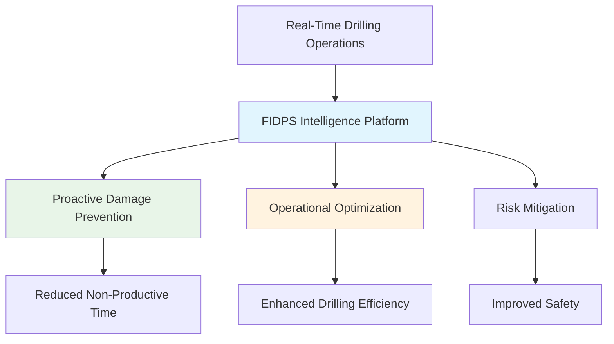

### **1.3 Key Business Objectives**
- Reduce formation damage incidents by 60%
- Decrease non-productive time by 40%
- Improve drilling efficiency by 25%
- Enable real-time operational decision making
- Ensure regulatory compliance and safety

---

## **2. System Architecture Overview**

### **2.1 High-Level System Architecture**

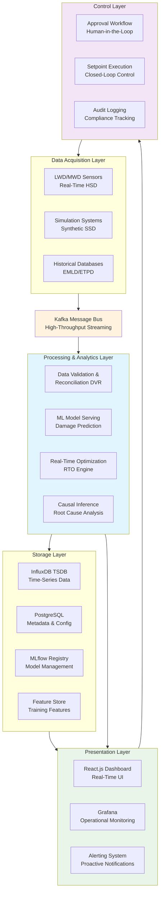

### **2.2 Technology Stack**

| Layer | Technology | Purpose |
|-------|------------|---------|
| **Frontend** | React.js, TypeScript, WebSocket | Real-time dashboard |
| **Backend** | Python, FastAPI, Kafka | Microservices architecture |
| **Data Processing** | Apache Flink, Spark | Stream processing |
| **Storage** | InfluxDB, PostgreSQL, Redis | Time-series & metadata |
| **ML/AI** | TensorFlow, PyTorch, MLflow | Model training & serving |
| **Monitoring** | Prometheus, Grafana | Observability |
| **Infrastructure** | Docker, Kubernetes, Helm | Container orchestration |

---

## **3. Formation Damage Taxonomy**

### **3.1 Comprehensive Damage Type Classification**

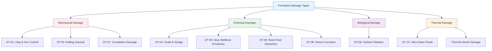

### **3.2 Damage Type Specifications**

| Damage ID | Damage Type | Primary Causes | Mitigation Strategies |
|-----------|-------------|----------------|----------------------|
| **DT-01** | Clay & Iron Control | Swelling clays, iron precipitation | Clay stabilizers, iron control agents |
| **DT-02** | Drilling Induced | Particle invasion, fines migration | Optimized drilling parameters |
| **DT-03** | Fluid Loss | High fluid loss, filter cake failure | Fluid loss additives, bridging agents |
| **DT-04** | Scale & Sludge | Mineral precipitation, incompatibility | Scale inhibitors, chemical treatment |
| **DT-05** | Near Wellbore Emulsions | Oil-water emulsions, wettability | Demulsifiers, surfactants |
| **DT-06** | Rock-Fluid Interaction | Chemical incompatibility, pH changes | Fluid system optimization |
| **DT-07** | Completion Damage | Perforation damage, cement issues | Completion fluid optimization |
| **DT-08** | Stress Corrosion | H2S, CO2 corrosion, stress cracking | Corrosion inhibitors, material selection |
| **DT-09** | Surface Filtration | Particulate contamination, solids | Filtration systems, solids control |
| **DT-10** | Ultra Clean Fluids | Excessive filtration, thermal effects | Fluid property management |

---

## **4. Functional Requirements**

### **4.1 Data Acquisition & Ingestion**

#### **FR-101: Multi-Source Data Integration**

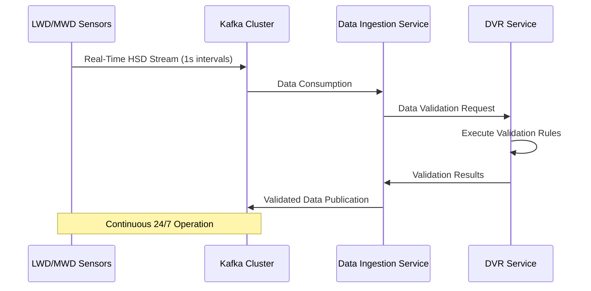

**Requirements:**
- Support simultaneous data ingestion from 50+ wells
- Handle 10,000+ data points per second
- Implement real-time data validation (DVR)
- Support HSD, SSD, EMLD, ETPD data classifications
- Auto-reconnection with exponential backoff

#### **FR-102: Sensor Data Processing**
- Process LWD/MWD data in 1-second intervals
- Support both simultaneous and serial data reading
- Implement data buffering for network resilience
- Real-time data quality assessment

### **4.2 Data Validation & Reconciliation (DVR)**

#### **FR-201: Data Quality Framework**

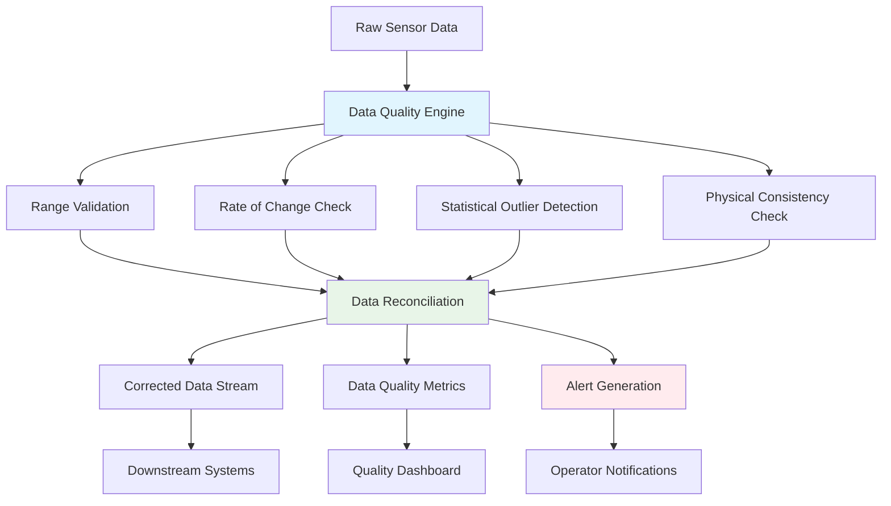

**Requirements:**
- Real-time data validation against operational limits
- Statistical outlier detection using IQR and Z-score methods
- Rate-of-change validation for critical parameters
- Automated data reconciliation algorithms
- Comprehensive data quality scoring

### **4.3 Machine Learning & Damage Prediction**

#### **FR-301: Damage Prediction Pipeline**

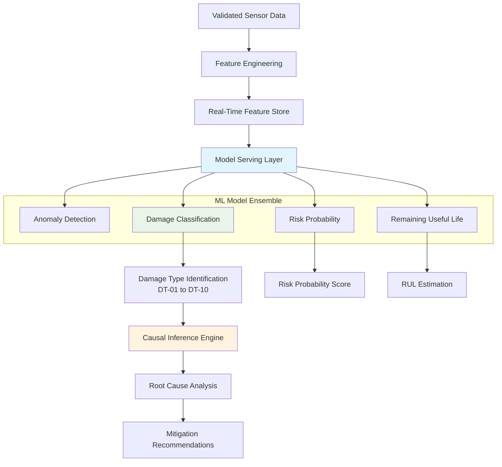

**Requirements:**
- Real-time damage type classification (DT-01 to DT-10)
- Probability scoring with confidence intervals
- Causal inference for root cause analysis
- Model versioning and A/B testing
- Automated model retraining triggers

#### **FR-302: Predictive Maintenance**
- Forecast time-to-integrity breach
- Identify top 3 preventative actions
- Equipment health monitoring
- Maintenance scheduling optimization

### **4.4 Real-Time Optimization (RTO)**

#### **FR-401: Optimization Engine**

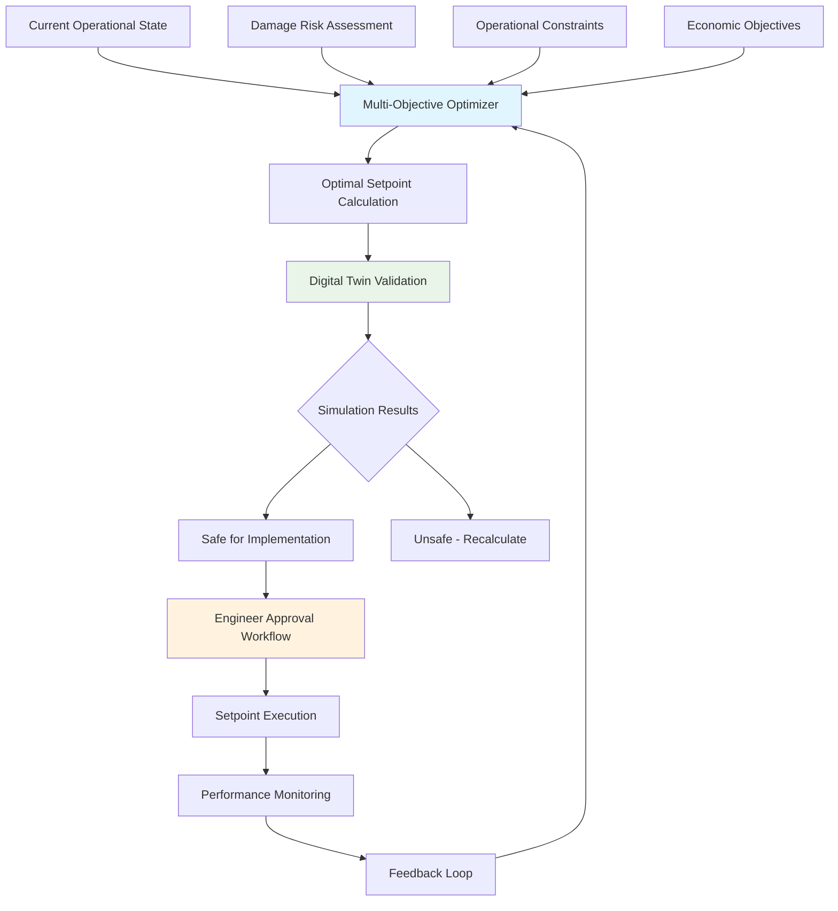

**Requirements:**
- Multi-objective optimization (safety, efficiency, cost)
- Digital twin simulation before execution
- Human-in-the-loop approval workflow
- Real-time optimization every 60 seconds
- Constraint handling and violation prevention

### **4.5 Dashboard & Visualization**

#### **FR-501: React.js Dashboard Architecture**

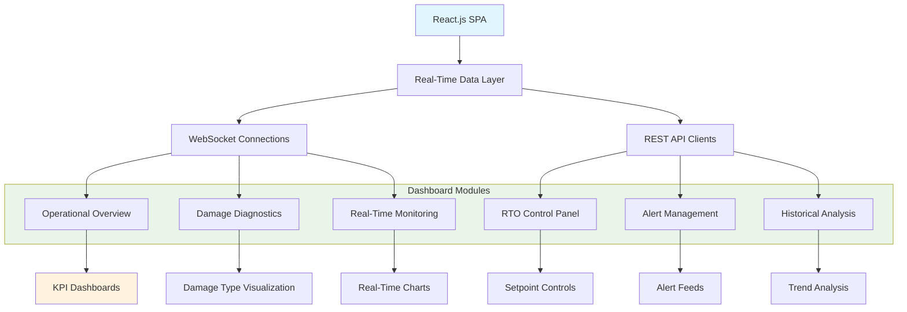

**Requirements:**
- Real-time data updates (1-5 second intervals)
- Interactive charts and visualization
- Damage type classification display
- RTO approval workflows
- Mobile-responsive design
- Offline capability for critical data

#### **FR-502: Damage Diagnostics Panel**
- Visual representation of damage types
- Probability and confidence indicators
- Root cause analysis visualization
- Mitigation recommendation display
- Historical damage trend analysis

---

## **5. Data Management Requirements**

### **5.1 Data Architecture**

#### **DR-101: Time-Series Data Management**

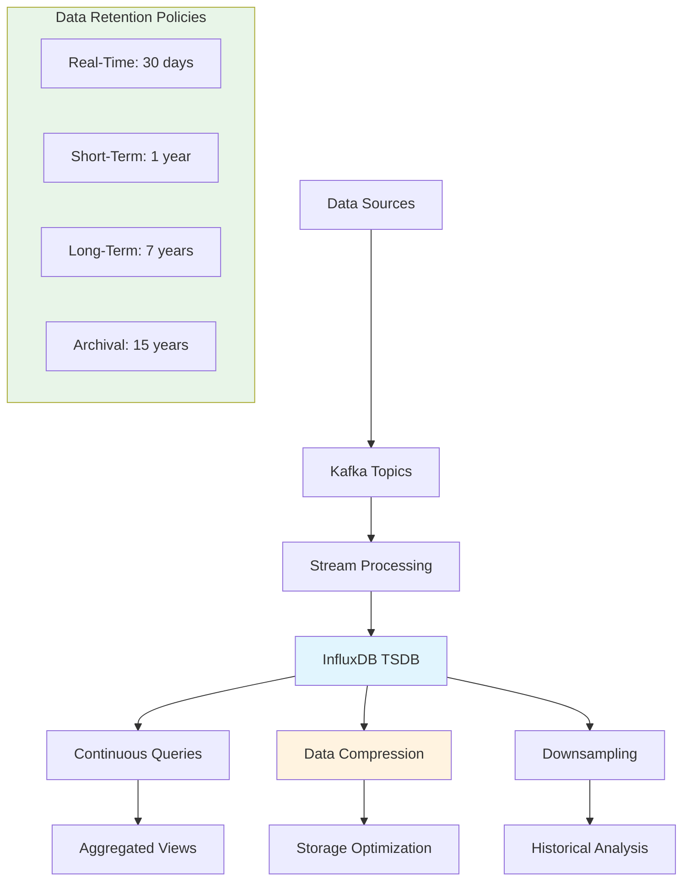

**Requirements:**
- 1-second resolution data storage
- Real-time data compression
- Automated downsampling strategies
- Tiered retention policies
- Efficient query performance for large datasets

### **5.2 Data Classification & Governance**

| Data Category | Description | Retention | Access Control |
|---------------|-------------|-----------|----------------|
| **HSD** | Historical/Sensor Data | 7 years | Role-based |
| **SSD** | Simulated/Synthetic Data | 3 years | Development teams |
| **EMLD** | Extended Measurement Logs | 10 years | Engineering teams |
| **ETPD** | Extended Test & Production | 15 years | Regulatory compliance |

---

## **6. Non-Functional Requirements**

### **6.1 Performance Requirements**

#### **NFR-101: System Performance Matrix**

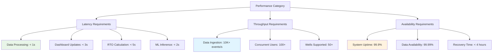

**Requirements:**
- API response time: < 100ms (95th percentile)
- Real-time data processing: < 1 second
- Dashboard data refresh: 1-5 seconds
- System availability: 99.9% uptime
- Data retention: 7+ years for compliance

### **6.2 Security Requirements**

#### **NFR-201: Security Framework**

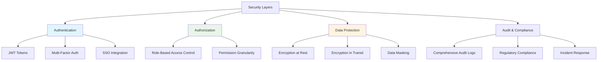

**Requirements:**
- Role-based access control (RBAC)
- Data encryption at rest and in transit
- Comprehensive audit logging
- SOC 2, ISO 27001 compliance
- Regular security penetration testing

### **6.3 Scalability & Reliability**

**Requirements:**
- Horizontal scaling for all microservices
- Support for 50+ concurrent wells
- Automatic failover and recovery
- Geographic redundancy
- Load balancing and auto-scaling

---

## **7. MLOps & DevOps Requirements**

### **7.1 CI/CD Pipeline**

#### **MLOps-101: Automated Deployment Pipeline**

```mermaid
graph TB
    A[Developer Commit] --> B[Git Repository]
    B --> C[CI Pipeline Trigger]
    
    subgraph D [Continuous Integration]
        D1[Code Quality Check]
        D2[Unit Tests (90%+ Coverage)]
        D3[Integration Tests]
        D4[Security Scanning]
        D5[Container Build]
    end
    
    C --> D1
    D1 --> D2
    D2 --> D3
    D3 --> D4
    D4 --> D5
    
    D5 --> E[Container Registry]
    E --> F[CD Pipeline]
    
    subgraph G [Continuous Deployment]
        G1[Staging Deployment]
        G2[Automated Testing]
        G3[Canary Release]
        G4[Production Deployment]
        G5[Health Validation]
    end
    
    F --> G1
    G1 --> G2
    G2 --> G3
    G3 --> G4
    G4 --> G5
    
    style D fill:#e1f5fe
    style G fill:#e8f5e8
```

**Requirements:**
- Automated testing with 90%+ code coverage
- GitOps-based deployment strategy
- Canary release with automated rollback
- Infrastructure as Code (IaC)
- Comprehensive monitoring and alerting

### **7.2 ML Model Management**

#### **MLOps-201: Model Lifecycle Management**

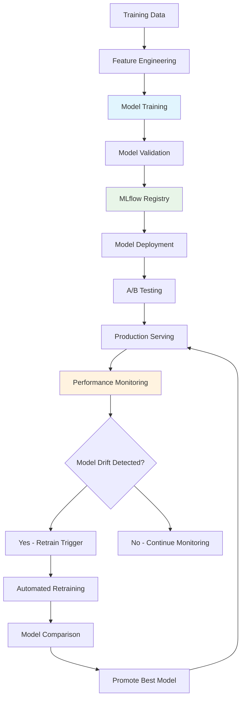

**Requirements:**
- MLflow for model versioning and tracking
- Automated model retraining pipelines
- Model performance monitoring and drift detection
- A/B testing framework
- Model explainability and bias monitoring

---

## **8. Monitoring & Observability**

### **8.1 Comprehensive Monitoring Stack**

#### **OBS-101: Observability Architecture**

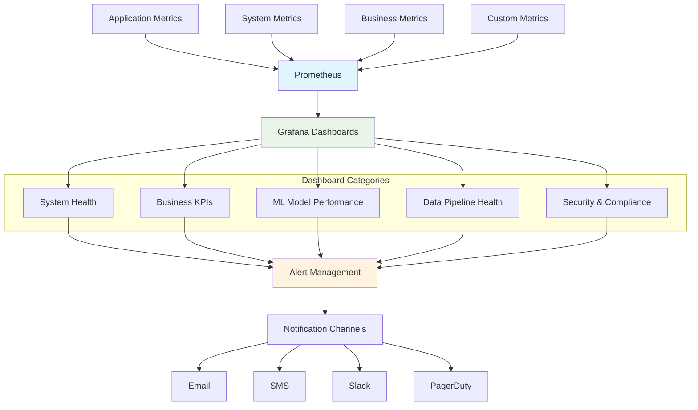

**Requirements:**
- Real-time system monitoring with Prometheus
- Comprehensive Grafana dashboards
- Multi-channel alert notifications
- Performance benchmarking and trending
- Capacity planning and forecasting

---

## **9. Deployment & Infrastructure**

### **9.1 Kubernetes Deployment Architecture**

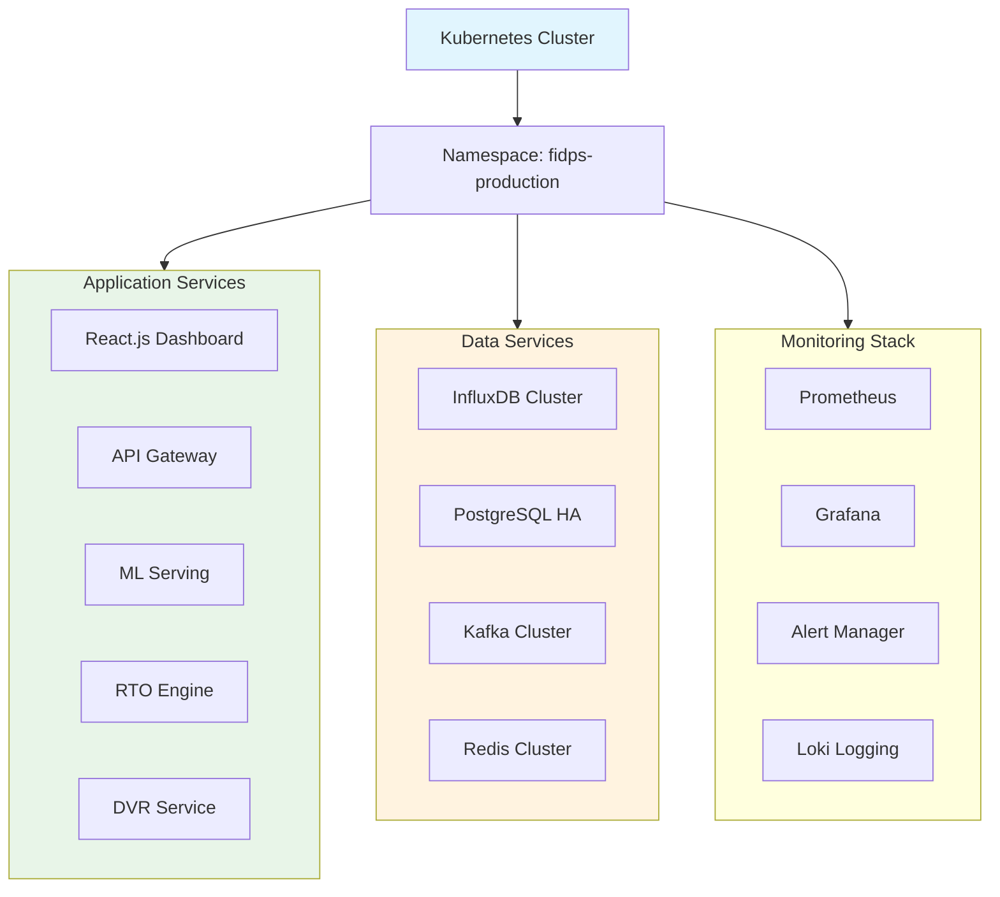

**Requirements:**
- Kubernetes-based container orchestration
- High availability configuration
- Automated scaling policies
- Disaster recovery procedures
- Backup and restore capabilities

---

## **10. Compliance & Regulatory Requirements**

### **10.1 Industry Standards Compliance**

- **API RP 67**: Recommended Practice for Oilfield Explosives Safety
- **API RP 76**: Contractor Safety Management for Oil and Gas Drilling
- **ISO 14224**: Petroleum, petrochemical and natural gas industries
- **NORSOK Standards**: Norwegian petroleum industry standards
- **OSHA Regulations**: Occupational Safety and Health Administration

### **10.2 Data Governance**
- Data lineage and provenance tracking
- Audit trail for all system actions
- Data retention policy enforcement
- Privacy and confidentiality protection
- Regulatory reporting capabilities

---

## **Appendices**

### **Appendix A: Complete Damage Type Specifications**
Detailed technical specifications for all 10 formation damage types including detection algorithms, mitigation strategies, and case studies.

### **Appendix B: API Documentation**
Comprehensive REST API documentation with authentication, endpoints, request/response examples, and error codes.

### **Appendix C: Deployment Guides**
Step-by-step deployment instructions for development, staging, and production environments including troubleshooting guides.

### **Appendix D: Performance Benchmarks**
Detailed performance test results, scalability analysis, and capacity planning guidelines.

