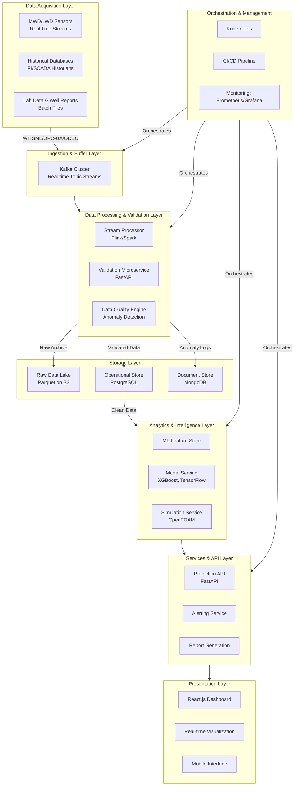

# 🛢️ Software Requirements Specification (SRS)
## **Intelligent Formation Integrity & Damage Prevention System (FIDPS)**

**Version:** 1.1
**Date:** October 26, 2023
**Status:** Draft for Review

---

## 1. Introduction

### 1.1 Purpose
This document specifies the requirements for the **Intelligent Formation Integrity & Damage Prevention System (FIDPS)**, an integrated software platform designed to **identify, predict, analyze, and prevent** formation damage in real-time during oil and gas drilling, completion, and production operations. FIDPS leverages machine learning, physical simulations, and a robust data pipeline to enhance decision-making and optimize operational efficiency.

### 1.2 System Scope
FIDPS is a comprehensive system that ingests real-time and historical data from field sensors (MWD/LWD), validates it, processes it through machine learning models for prediction and classification, runs simulations for deeper analysis, and presents all insights through an interactive visual dashboard. It is designed for use by drilling engineers, production managers, and petrophysicists in both onshore and offshore environments.

### 1.3 Definitions and Acronyms

| Term/Acronym | Description |
| :--- | :--- |
| **FIDPS** | Formation Integrity & Damage Prevention System |
| **MWD/LWD** | Measurement/Logging While Drilling |
| **ECD** | Equivalent Circulating Density |
| **OBM/WBM** | Oil/Water-Based Mud |
| **SHAP** | SHapley Additive exPlanations (for model interpretability) |
| **FEM** | Finite Element Method (for simulations) |
| **RMSE/MAE** | Root Mean Squared Error / Mean Absolute Error (model metrics) |
| **R²** | Coefficient of Determination (model metric) |

---

## 2. Overall Description

### 2.1 Vision
To become the industry-standard platform for proactive formation damage management, significantly reducing non-productive time (NPT) and completion costs by transforming raw operational data into actionable, predictive insights.

### 2.2 Key Features
- **Real-Time Data Validation:** A robust pipeline to clean, validate, and tag incoming sensor data.
- **Multi-Model ML Engine:** Employs a suite of algorithms (XGBoost, LSTM, GRU, etc.) for classification, regression, and anomaly detection.
- **Physical Simulation Integration:** Uses OpenFOAM/FEniCS for simulating damage processes like fluid loss and emulsion formation.
- **Interactive Dashboard:** A web-based UI for real-time monitoring, historical analysis, and alert management.
- **Synthetic Data Generation:** A module for creating high-fidelity synthetic data to augment training and testing.

### 2.3 Constraints
- Requires high-frequency (≥1 Hz), high-integrity sensor data streams.
- Performance is dependent on GPU resources for model training and complex simulations.
- Must be operable in environments with intermittent network connectivity.

---

## 3. Functional Requirements (FR)

### **FR-1: Data Ingestion & Validation Pipeline**
- **FR-1.1:** The system shall ingest real-time data streams from MWD/LWD tools and historical databases.
- **FR-1.2:** The system shall validate all incoming data against predefined domain rules (value ranges, null checks, unit consistency).
- **FR-1.3:** The system shall tag and log anomalous records for review while routing clean data to downstream modules.

### **FR-2: Machine Learning Core**
- **FR-2.1:** The system shall classify the type of formation damage (from the predefined list of 10 types) using ensemble models (XGBoost/LightGBM).
- **FR-2.2:** The system shall predict continuous values (e.g., fluid loss volume) using regression models (XGBoost Regression, Polynomial Regression).
- **FR-2.3:** The system shall forecast time-series-based risks (e.g., emulsion onset) using recurrent neural networks (LSTM/GRU).
- **FR-2.4:** The system shall identify novel or hidden damage patterns using unsupervised clustering algorithms (KMeans, DBSCAN).
- **FR-2.5:** The system shall detect anomalous operational conditions using anomaly detection algorithms (Isolation Forest, Autoencoders).

### **FR-3: Simulation Module**
- **FR-3.1:** The system shall run finite element simulations (via OpenFOAM/FEniCS) to model physical damage processes for a given set of parameters.
- **FR-3.2:** The system shall allow users to configure and submit simulation scenarios via the API.

### **FR-4: Dashboard & Visualization**
- **FR-4.1:** The dashboard shall display real-time operational parameters (Pressure, ECD, Temperature, RPM, etc.) in time-series charts.
- **FR-4.2:** The dashboard shall visually differentiate between validated and anomalous data points.
- **FR-4.3:** The dashboard shall present ML predictions (damage type, risk score) and model explanations (e.g., SHAP force plots).
- **FR-4.4:** The dashboard shall provide filtering capabilities by well, depth, date range, and damage type.

### **FR-5: Alerting & Reporting**
- **FR-5.1:** The system shall trigger visual and auditory alerts in the dashboard when predicted values exceed critical thresholds.
- **FR-5.2:** The system shall generate summary reports of damage events, model performance, and operational recommendations.

### **FR-6: Data Management**
- **FR-6.1:** The system shall generate synthetic data for model development and testing, mimicking the statistical properties of real field data.
- **FR-6.2:** The system shall store structured data in PostgreSQL and semi-structured data (logs, model artifacts) in MongoDB.

---

## 4. Formation Damage Types Covered

The system shall detect, classify, and analyze the following formation damage types:

| Damage Type ID | Damage Type | Description |
| :--- | :--- | :--- |
| **DT-01** | **Clay & Iron Control** | Chemical interactions with clay and iron minerals causing swelling, dispersion, or migration |
| **DT-02** | **Drilling-Induced Damage** | Mechanical and pressure-related damage during drilling operations (e.g., mud invasion, fines migration) |
| **DT-03** | **Fluid Loss** | Loss of drilling or stimulation fluids into the formation |
| **DT-04** | **Scale/Sludge Incompatibility** | Formation of inorganic or organic deposits (scale, asphaltenes, paraffins) |
| **DT-05** | **Near-Wellbore Emulsions** | Emulsion formation near the wellbore reducing effective permeability |
| **DT-06** | **Rock/Fluid Interaction** | Incompatibility between formation rock and fluids leading to permeability reduction |
| **DT-07** | **Completion Damage** | Loss of connectivity between formation and completion system |
| **DT-08** | **Stress/Corrosion Cracking** | Cracks caused by stress or corrosion mechanisms |
| **DT-09** | **Surface Filtration** | Surface fluid filtration disruptions affecting well productivity |
| **DT-10** | **Ultra-Clean Fluids Control** | Management of high-purity fluids during stimulation operations |

---

## 5. Non-Functional Requirements (NFR)

| ID | Category | Requirement |
| :--- | :--- | :--- |
| **NFR-1** | **Performance** | The data validation pipeline must process records at a frequency of ≥1 Hz. |
| **NFR-2** | **Performance** | Model inference (prediction) must occur with a latency of <5 seconds from data receipt. |
| **NFR-3** | **Reliability** | The system must be able to handle temporary network outages with data buffering and replay capabilities. |
| **NFR-4** | **Scalability** | The architecture must support data ingestion and analysis for at least 50 concurrent wells. |
| **NFR-5** | **Security** | All data transmissions must be encrypted with TLS. Access must be controlled via Role-Based Access Control (RBAC). |
| **NFR-6** | **Maintainability** | The codebase must be modular, well-documented, and accompanied by a CI/CD pipeline. |
| **NFR-7** | **Usability** | The dashboard must be intuitive and require less than 2 hours of training for a field engineer to use effectively. |


## 6. System Architecture & Data Flow

### 6.1 High-Level Data Flow Architecture
The following schematic illustrates the end-to-end data pipeline from acquisition to insight:



### 6.2 Data Schema (Enhanced)
The system utilizes a structured schema across multiple storage technologies:

**PostgreSQL (Operational Data Store)**
```sql
CREATE TABLE well_measurements (
    measurement_id UUID PRIMARY KEY,
    well_id VARCHAR(50) NOT NULL,
    timestamp TIMESTAMPTZ NOT NULL,
    depth DECIMAL(10, 2),
    mud_type VARCHAR(20),
    rpm INTEGER,
    spp DECIMAL(10, 2),
    flow_rate DECIMAL(10, 2),
    viscosity DECIMAL(10, 2),
    temperature DECIMAL(10, 2),
    ecd DECIMAL(10, 2),
    shale_content DECIMAL(5, 2),
    lithology VARCHAR(50),
    ph DECIMAL(4, 2),
    cl_concentration DECIMAL(10, 2),
    oil_water_ratio DECIMAL(5, 2),
    is_anomaly BOOLEAN DEFAULT FALSE,
    damage_type_prediction VARCHAR(50),
    prediction_confidence DECIMAL(5, 4),
    created_at TIMESTAMPTZ DEFAULT NOW()
);

CREATE TABLE damage_types (
    damage_type_id VARCHAR(10) PRIMARY KEY,
    damage_name VARCHAR(100) NOT NULL,
    description TEXT,
    severity_level INTEGER,
    common_causes TEXT[],
    mitigation_strategies TEXT[]
);
```

**MongoDB (Document Store for Anomalies & Events)**
```json
{
  "event_id": "event_12345",
  "well_id": "well_abc",
  "timestamp": "2024-05-21T10:30:00Z",
  "event_type": "data_validation_failure",
  "severity": "high",
  "description": "ECD value out of range: 3.5 sg",
  "original_value": 3.5,
  "expected_range": { "min": 0.8, "max": 2.5 },
  "field_name": "ecd",
  "processing_stage": "validation_microservice",
  "suggested_action": "Check sensor calibration"
}
```

### 6.3 Technology Stack (Enhanced)

| Layer | Technology | Purpose |
| :--- | :--- | :--- |
| **Data Acquisition** | WITSML, OPC-UA, ODBC | Standardized field data communication |
| **Stream Processing** | Apache Kafka, Flink | Real-time data ingestion and processing |
| **Data Validation** | FastAPI, Pandera, Great Expectations | Data quality and validation framework |
| **Storage** | PostgreSQL, MongoDB, S3 (Parquet) | Operational, document, and data lake storage |
| **Machine Learning** | XGBoost, TensorFlow, Scikit-learn | Model training and serving |
| **Simulation** | OpenFOAM, FEniCS | Physics-based modeling |
| **API & Services** | FastAPI, Redis | Microservices architecture |
| **Frontend** | React.js, D3.js, Plotly | Interactive visualization |
| **Monitoring** | Prometheus, Grafana, ELK Stack | System observability |
| **Orchestration** | Kubernetes, Docker, Helm | Container orchestration |
| **CI/CD** | GitLab CI, ArgoCD | Automated deployment pipeline |

### 6.4 Data Flow Stages

**Stage 1: Acquisition**
- Real-time data ingested via WITSML/OPC-UA protocols at ≥1 Hz frequency
- Historical data batched from PI/SCADA systems
- Lab data imported via structured files (CSV, JSON)

**Stage 2: Ingestion & Buffering**
- Kafka topics provide durable buffering and backpressure handling
- Schema registry ensures data consistency
- Allows for multiple consumers of the same data streams

**Stage 3: Validation & Processing**
- Schema validation: Data type, format, and unit consistency
- Domain validation: Physical range checks (e.g., 0.8 ≤ ECD ≤ 2.5 sg)
- Statistical validation: outlier detection using moving averages
- Data enrichment: addition of derived features and contextual information

**Stage 4: Storage & Archiving**
- Validated data stored in PostgreSQL for operational use
- Anomalies and events logged to MongoDB for investigation
- Raw data archived to S3 in Parquet format for compliance and reprocessing

**Stage 5: Analytics & Intelligence**
- Feature engineering creates ML-ready datasets
- Model serving provides real-time predictions
- Simulation service runs physics-based models for complex scenarios

**Stage 6: Presentation & Action**
- React dashboard provides real-time visualization
- Alerting system triggers notifications for critical events
- Reporting module generates operational insights

### 6.5 Data Retention Policies

| Data Type | Retention Period | Storage Tier | Purpose |
| :--- | :--- | :--- | :--- |
| Real-time operational data | 90 days | PostgreSQL (Hot) | Real-time monitoring and alerting |
| Historical operational data | 5 years | PostgreSQL (Warm) | Trend analysis and reporting |
| Anomaly and event data | 2 years | MongoDB | Audit and investigation |
| Raw sensor data | 7 years | S3 Glacier (Cold) | Regulatory compliance |
| ML training data | Indefinite | S3 Standard | Model retraining and improvement |

---

## 7. Appendices

### 7.1 Deployment Architecture

```bash
# Production Deployment via Helm/Kubernetes
helm install fidps-production ./charts/fidps \
  --set global.env=production \
  --set ingress.hostname=fidps.company.com \
  --set database.postgresql.storage=1Ti \
  --set kafka.brokers=5 \
  --set ml.gpu.enabled=true
```

### 7.2 Monitoring Setup

```yaml
# Sample Grafana Dashboard for Data Pipeline Health
apiVersion: 1
datasources:
  - name: Prometheus
    type: prometheus
    access: proxy
    url: http://prometheus-server:9090

panels:
  - title: Data Ingestion Rate
    targets:
      - expr: rate(kafka_topic_messages_total{topic="well-data"}[5m])
        legendFormat: {{topic}}
```

### 7.3 Disaster Recovery Strategy

- **Multi-AZ Deployment:** Critical services deployed across availability zones
- **Backup Policy:** Daily snapshots of operational databases
- **Replication:** Cross-region replication of data lake storage
- **Recovery Time Objective (RTO):** < 4 hours for critical services
- **Recovery Point Objective (RPO):** < 15 minutes of data loss

---

This enhanced architecture provides a robust, scalable foundation for the FIDPS platform, ensuring reliable data flow from acquisition to actionable insights while maintaining data quality and system reliability.
